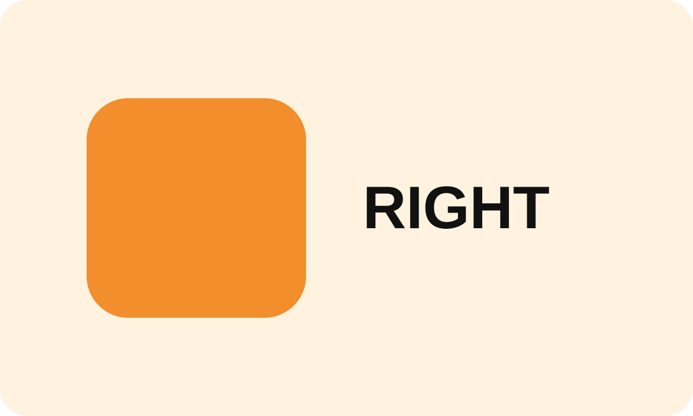

<!-- slide
id: export-text
type: content
layout: text
footer: false
-->
# 最终静态状态
## 导出时应直接显示全部内容

### 默认无动效

PDF 与 PowerPoint 都应包含这一段正文，即使页面 reveal 尚未完成。

---

<!-- slide
id: export-gallery
type: content
layout: gallery
gallery-display: tabs
tab-labels: 左图 | 右图
footer: false
-->
# Gallery 完整导出
## 两个 Tab 应展开为连续静态页面

---

<!-- slide
id: export-video
type: content
layout: media
footer: false
-->
# 视频静态化
## 导出文件只保留 poster，不包含视频媒体或播放控件

